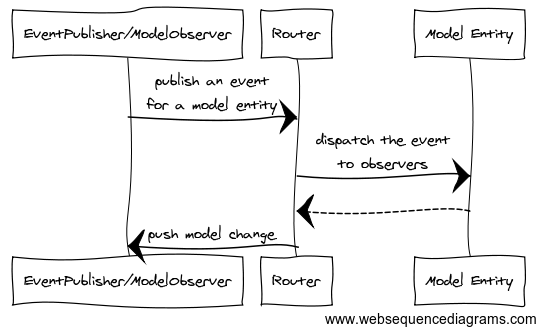

# Reactive Domain Model

The *Reactive Domain Model* merges the previous two approaches.
The model entities take ownership of event observation, they are responsible for all logic related to the given entity.
This includes interacting with [asynchronous](../advanced-concepts/asynchronous-operations.md) services to fetch or push data, model persistence, model validation, business logic etc.
The models public interface is read-only.
If necessary the model entity (i.e. event observers) can propagate events through the model using the [event workflow](../advanced-concepts/complete-event-workflow.md).
This allows entities to react to events in stages and somewhat decouples entities from the root object.

The below diagram shows the moving parts.
Events flow from the publisher, via the `Router` directly to the entity responsible for the given event type.
When all events have been processed the model is then dispatched to observers.
Given the model exposes a read only API, observers can interrogate it but not change it.

Not every model entity observes events.
The very leaf node entities (which may be collections, or simple model types) would still be manipulated by their parent.
For example, the below class diagram shows a model with 3 entities: `ChatScreenModel`, `FriendList` and `InputField`.
Some properties on the entities are themselves complex entities (e.g. the `SearchInput` which is an `InputField`).
The 2 main entities, `ChatScreenModel` and `FriendList` would observe events on the `Router` and update their state, `FriendList` would update state of `SearchInput`.
Their children would expose a sensible API to ensure their state is safely updated by the parent (i.e. they are not just read/write).
Which entities take the `Router` is really up to you.
A general rule is start off with 1-2 main entities then break them down as you identify self contained state and associated business logic.

> ##### Note
> It's worth noting the [event observation signature](../router-api/event-pub-sub.md#event-observation-signature).
> When the model dispatches an event to observers, one the parameters passed by the `Router` is the model root.
> This means any entity in the hierarchy has access to root model (which as discussed above should be designed as read only) for reference.
> Be diligent using the root model, if you find yourself relying on this, or end up using the train wreak pattern (for.bar.baz.value.foo.final.value) to get access to other nodes of the model, it's likely you have a modeling deficiency elsewhere.

## Source code examples
There are [examples](../examples/index.md) checked into both .Net and JS implementations using this approach, specifically:

* [JS React chat app (port from flux)](https://github.com/esp/esp-js/tree/master/examples/esp-chat-react-es6)